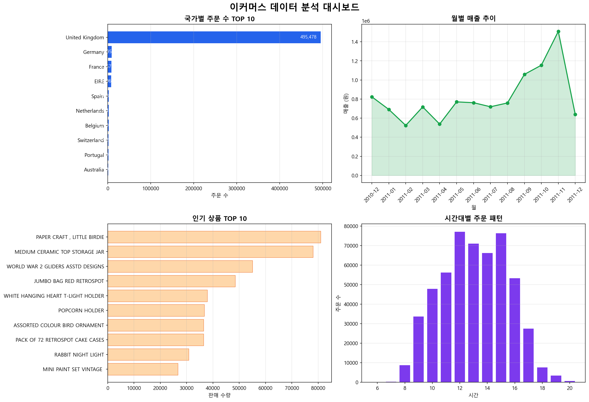
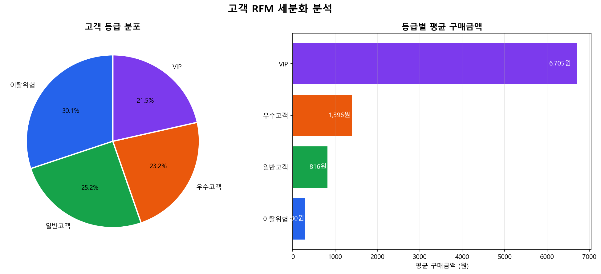

# 🛒 이커머스 고객 구매 데이터 분석 & RFM 고객 세분화

## 📌 핵심 요약
- 문제: 어떤 고객이 매출에 가장 크게 기여하는지 분석
- 결과: VIP 고객이 매출의 대부분 차지
- 결론: 고객 유지 중심 마케팅 전략 필요

## 📌 프로젝트 개요
UK 기반 이커머스 플랫폼의 541,909건 거래 데이터를 분석하고
RFM 모델로 고객을 세분화한 프로젝트입니다.

## 🎯 문제 정의
이 프로젝트는 고객 구매 데이터를 기반으로 핵심 고객(VIP)과 이탈 가능 고객을 식별하고, 매출 증대를 위한 마케팅 전략을 도출하는 것을 목표로 진행했습니다.

## 🌐 도메인 배경
이커머스 시장에서 고객 유지 비용은 신규 고객 획득 비용보다
5배 저렴합니다. 따라서 기존 고객을 세분화하여 맞춤형 마케팅
전략을 수립하는 것이 매우 중요합니다.

## 🎯 분석 목적
- 국가별 / 월별 / 시간대별 구매 패턴 파악
- 인기 상품 분석
- RFM 모델로 고객 등급 세분화

## 🔍 가설 설정
- 가설 1. 영국이 전체 주문의 대부분을 차지할 것이다
- 가설 2. 연말(11~12월)에 매출이 가장 높을 것이다
- 가설 3. 오전 10~12시에 주문이 가장 많을 것이다
- 가설 4. VIP 고객이 전체 매출의 대부분을 차지할 것이다

## 🛠️ 사용 기술
- **Language**: Python
- **Library**: Pandas, Matplotlib, SQLAlchemy
- **Database**: MySQL
- **Tool**: PyCharm, Excel, GitHub

## 📊 분석 결과

### 메인 대시보드

### RFM 고객 세분화

## ✅ 가설 검증 결과
- 가설 1. ✅ 채택 — 영국이 전체 주문의 91% 차지
- 가설 2. ✅ 채택 — 11월 매출이 가장 높음
- 가설 3. ✅ 채택 — 오전 10시에 주문 최고조
- 가설 4. ✅ 채택 — VIP 고객 평균 구매금액이 이탈위험 고객의 약 20배

💡 핵심 인사이트
- 영국이 전체 주문의 91%로 압도적 1위 → 지역 집중형 비즈니스 구조
- 연말 쇼핑 시즌(11~12월) 매출 급증 → 시즌 기반 마케팅 전략 필요
- 오전 10시가 주문 피크타임 → 시간대 타겟 광고 가능
- VIP 고객(24.6%)이 전체 매출을 주도 → 핵심 고객 유지 전략 중요
- 이탈위험 고객(30.1%) 재활성화 전략 필요 → 쿠폰/이벤트 필요

## 🚀 결론 및 마케팅 전략
- VIP 고객: 충성 고객 유지 프로그램(포인트, 전용 할인) 필요
- 일반 고객: 재구매 유도를 위한 추천 시스템 활용
- 이탈 고객: 할인 쿠폰 및 리마인드 마케팅 필요
- 시간대별 마케팅: 오전 10시 집중 광고 전략 효과적
- 시즌 마케팅: 11~12월 집중 프로모션 강화

👉 고객 유지 전략이 신규 고객 유입보다 비용 효율성이 높음

## 📈 기대 효과
- 고객 세분화를 통한 마케팅 효율 증가
- VIP 고객 유지로 매출 안정성 확보
- 이탈 고객 감소를 통한 장기 매출 증가

## 📂 파일 구조
- `main.py` - Python 분석 및 RFM 세분화 코드
- `ecommerce_dashboard.png` - 메인 대시보드
- `ecommerce_rfm.png` - RFM 고객 세분화 결과
